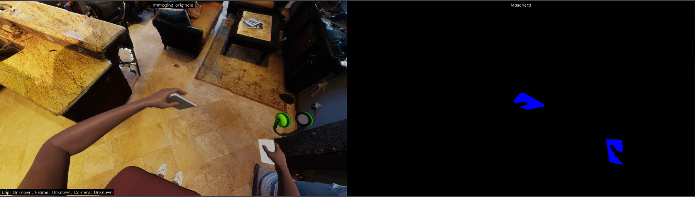
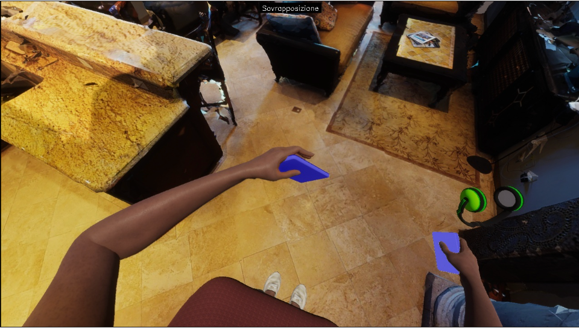
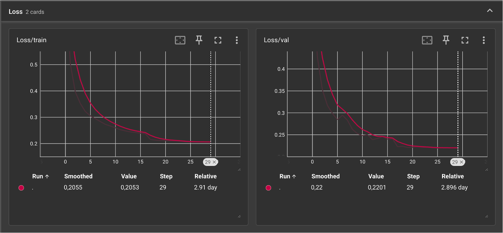
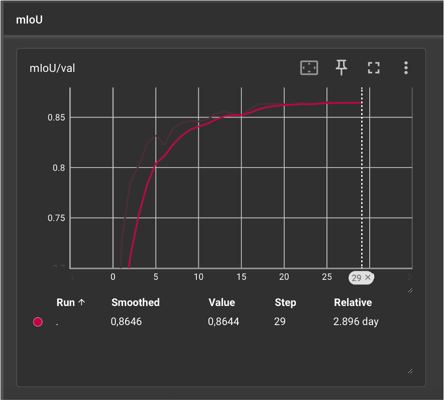
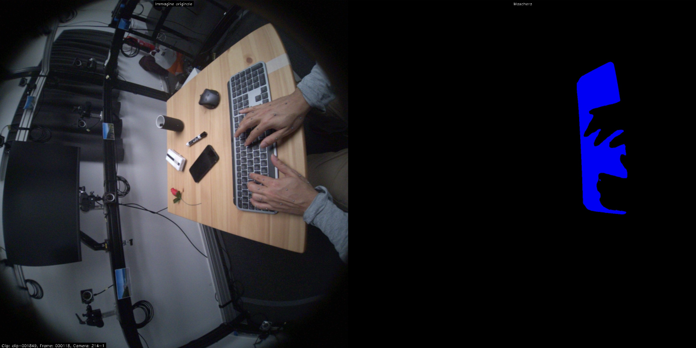
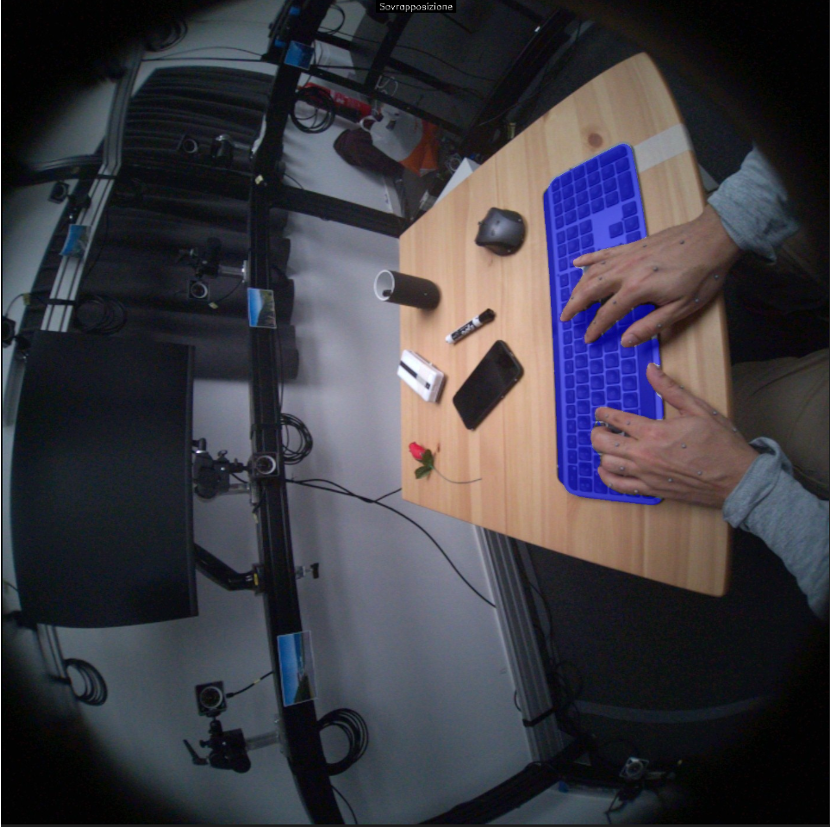
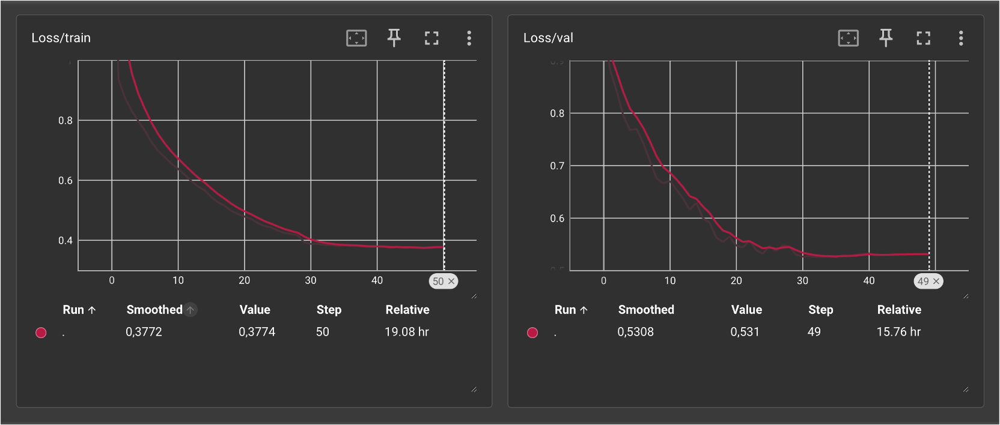
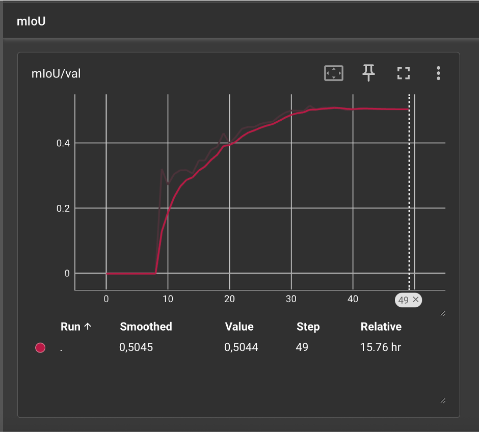

# 2D Segmentation of In-Hand Objects using Mask R-CNN

This task focuses on **predicting a binary 2D mask for objects held in hand**, given an input image. This segmentation step is crucial for the subsequent 3D lifting of handheld objects and is also useful for downstream applications such as hand state classification or activity recognition in videos. The goal is to accurately segment in-hand objects to support these applications.

- Inputs:
    - Input Images: Egocentric images, specifically from the `visor_hoi_synth` dataset (see below).
    - Ground-Truth Masks: Binary masks indicating the exact location of objects held in hand within the input images, provided by the `visor_hoi_synth` dataset. These masks serve as a reference for evaluating the accuracy of predicted segmentations.
- Output:
    - Predicted 2D Masks: Binary 2D masks generated for objects held in hand. These masks highlight the regions in the image corresponding to handheld objects and serve as a foundation for further processing.

This project implements a Mask R-CNN model for detecting and segmenting objects held in hand in egocentric videos. It **primarily leverages `visor_hoi_synth`, a synthetic dataset component of the HOI-Synth benchmark**. The HOI-Synth benchmark (Leonardi et al., ECCV 2024) extends existing egocentric datasets like EPIC-KITCHENS VISOR with automatically labeled synthetic data. The `visor_hoi_synth` data specifically provides synthetic images and annotations tailored for hand-object interaction tasks, designed to augment or be used with the real VISOR dataset. This project demonstrates an end-to-end pipeline including data preprocessing, model training, evaluation, and inference using these synthetic data.
(The project structure also shows adaptability for other datasets like HOT3D, as indicated by some cache and visualization directories, but the core work presented here focuses on `visor_hoi_synth`.)

## Project Overview

The primary goal is to accurately segment objects that a person is interacting with, as viewed from a first-person perspective, using synthetic egocentric data. This is achieved using a Mask R-CNN architecture built with PyTorch.

## Key Features

*   **Mask R-CNN Model:** PyTorch-based implementation with configurable backbones (e.g., ResNeXt-101-FPN, ResNet-50-FPN).
*   **Data Preprocessing:** Scripts to process raw `visor_hoi_synth` images and JSON annotations into optimized `.npy` cache files for faster loading during training. (Logic might be adaptable for other formats like VISOR or HOT3D).
*   **Training Pipeline:**
    *   GPU support.
    *   Checkpoint loading to resume training.
    *   Configurable optimizers (SGD, AdamW).
    *   Learning rate scheduling (ReduceLROnPlateau).
    *   Gradient clipping.
    *   TensorBoard logging for losses and metrics.
    *   Saves the best model based on validation mIoU.
*   **Evaluation Pipeline:**
    *   Calculates metrics: Precision, Recall, F1-Score, and Mean Intersection over Union (mIoU) for masks.
    *   Saves evaluation results to JSON files.
*   **Inference Pipeline:**
    *   Runs inference on single images or directories.
    *   Generates visual outputs with overlaid masks, bounding boxes, and labels.
*   **Data Augmentation:** Includes basic transforms like random horizontal flipping.
*   **Data Visualization:** Utilities to visualize preprocessed dataset samples with their corresponding masks, aiding in debugging and data verification.
*   **Centralized Configuration:** `config.py` for managing paths, hyperparameters, and dataset-specific settings.

## Prerequisites

*   Python 3.x
*   PyTorch (>=1.8)
*   TorchVision (>=0.9)
*   NumPy
*   OpenCV (`cv2`)
*   tqdm
*   pycocotools (for `mask_utils` used in VISOR preprocessing)
*   TensorBoard

It's recommended to create a virtual environment. You can install dependencies using the provided `requirements.txt`:

```bash
pip install -r requirements.txt
```

If `requirements.txt` is not exhaustive, you might need to install some manually:

```bash
pip install torch torchvision torchaudio
pip install numpy opencv-python tqdm pycocotools tensorboard
```

## Setup

### Clone the Repository:
 
```bash
git clone git@github.com:nameisalfio/2d_Segmentation_of_in-hand_objects.git
cd 2d_Segmentation_of_in-hand_objects
```

### Install Dependencies:

As mentioned in the Prerequisites section.

### Configure Paths:

Modify `config.py` to set up essential paths:
- `HOME_DIR`: Your base directory for the project and data.
- `VISOR_HOI_SYNTH_PATH` (or the variable you use, e.g., `VISOR_EGOHOS_SYNTH` if you've kept that name): Path to the root directory of your **`visor_hoi_synth` dataset**. This dataset is part of the [HOI-Synth benchmark](https://fpv-iplab.github.io/HOI-Synth/) and contains synthetic images and annotations.
  * *Note: If your variable in `config.py` is still `VISOR_EGOHOS_SYNTH`, be aware that for this project, it's being used to point specifically to the `visor_hoi_synth` data.*

Ensure that directories like `MODELS_DIR`, `RESULTS_DIR`, `DATASET_CACHE_DIR` (e.g., `dataset_cache_visor`), etc., defined in `config.py` are writable.

### Downloads
Pre-trained models, dataset caches, and TensorBoard logs corresponding to the results shown in this README (trained on `visor_hoi_synth`) can be downloaded using the following links:

📁 [Google Drive folder (all assets)](https://drive.google.com/uc?export=download&id=155Q0rV3RSJzD7LXe5_njGbvBq70_eOXD)

The folder structure on Google Drive mirrors the local project structure:
- `saved_models/`: Contains trained model checkpoints (.pth files) from `visor_hoi_synth` training.
- `dataset_cache_visor/`: Preprocessed .npy cache files for the `visor_hoi_synth` dataset.
- `tensorboard_logs_visor/`: TensorBoard event files for `visor_hoi_synth` training runs.
(The `dataset_cache_hot3d/` and `tensorboard_logs_hot3d/` are for potential experiments with the HOT3D dataset, not the primary focus here.)

You can download these and place them in the corresponding directories within your local project structure to skip certain preprocessing or training steps for `visor_hoi_synth`.

## Dataset Preparation

The system relies on `.npy` cache files for efficient data loading. These are generated from your raw dataset.

### Place Raw Dataset:

Ensure your **`visor_hoi_synth` dataset** (obtained as part of the HOI-Synth benchmark) is downloaded and located at the path specified by your dataset path variable (e.g., `VISOR_HOI_SYNTH_PATH`) in `config.py`.

The HOI-Synth benchmark provides synthetic data. For `visor_hoi_synth`, the structure will generally follow the HOS format (compatible with VISOR-HOS):
Use code with caution.
Markdown
<YOUR_VISOR_HOI_SYNTH_PATH>/ # This path should correspond to where you extracted HOI-Synth's images and annotations
├── images/
│ └── epic_kitchens_visor_synth/ # Or similar subfolder for VISOR-specific synthetic images from HOI-Synth
│ ├── P01_01_frame_0000001234.jpg
│ └── ...
├── annotations/
│ ├── train.json # Annotations for the synthetic training split
│ ├── val.json # Annotations for the synthetic validation split
│ └── ... # (e.g., train_10.json for 10% data, or combined files if using them)
└── ...

*Note: The exact subfolder name under `images/` (e.g., `epic_kitchens_visor_synth`) depends on how HOI-Synth organizes its downloaded synthetic images. Please verify this structure with your downloaded data. The `annotations.zip` and `images.zip` from HOI-Synth should be extracted such that `annotations/` contains the JSON files and `images/` contains subfolders for each synthetic dataset component (like `epic_kitchens_visor_synth`, `egohos_synth`, etc.). Your path should point to this root extracted directory.*

### Run Preprocessing Script:

The `data/dataset.py` script (via its main function or `build_dataset_files`) triggers the preprocessing logic. To generate cache files for the `visor_hoi_synth` dataset (assuming it's configured to be processed as "visor" type in your scripts, and its images are in a subfolder like `images/epic_kitchens_visor_synth/` relative to your dataset root):

```bash
python data/dataset.py --action preprocess --dataset all [--debug]
```

- `--action preprocess`: Executes the preprocessing step.
- `--dataset all`: Processes train, val, and test splits. Use `train`, `val`, or `test` for specific splits.
- `--debug` (optional): Enables saving debug images during preprocessing.

This will create `train_dataset.npy`, `val_dataset.npy`, and `test_dataset.npy` in the respective cache directory (e.g., `dataset_cache_visor`) defined in `config.py`. If you are also processing HOT3D, ensure its specific preprocessing logic is run to populate `dataset_cache_hot3d`.

## Usage

All primary operations (train, evaluate, inference) are managed via `main.py`.

### 1. Training

To train a new model or resume training:

```bash
python main.py train \
    --epochs 50 \
    --batch_size 2 \
    --lr 0.001 \
    --backbone resnext101_32x8d \
    --num_classes 2 \
    # --no_pretrained \
    # --resume path/to/checkpoint.pth \
    # --output path/to/save/model.pth \
    # --clip_grad_norm 1.0 \
    # --optimizer adamw
```

Key arguments are shown. Defaults are often pulled from `config.py`.
- `--num_classes 2` is typical for "background" + "object_in_hand".

TensorBoard logs are saved to `TENSORBOARD_DIR` (e.g., `tensorboard_logs_visor`). View with:

```bash
tensorboard --logdir tensorboard_logs_visor
```

### 2. Evaluation

To evaluate a trained model:

```bash
python main.py evaluate \
    --model saved_models/mask_rcnn_final_visor.pth \
    --dataset_type test \
    # --threshold 0.5 \
    # --iou_threshold 0.5 \
    # --num_classes 2 \
    # --backbone resnext101_32x8d
```

- `--model`: Path to the trained `.pth` model file.
- `--dataset_type`: Which data split to evaluate on (`train`, `val`, `test`).
- `--num_classes` and `--backbone` should match the loaded model's training configuration.

Evaluation results (metrics) are saved as JSON in `RESULTS_DIR`.

### 3. Inference

To run inference on new images:

```bash
python main.py inference \
    --model saved_models/mask_rcnn_final_visor.pth \
    --input path/to/your/image.jpg_or_directory \
    --output inference_output_directory \
    # --threshold 0.5 \
    # --num_classes 2 \
    # --class_names "background,object_in_hand" \
    # --show
```

- `--input`: Path to a single image or a directory of images.
- `--output`: Directory to save annotated images.
- `--class_names` (optional): Comma-separated class names for visualization.
- `--show`: If input is a single image, displays the result.

### 4. Dataset Visualization Utilities

To inspect preprocessed `.npy` dataset samples (for debugging/verification):

```bash
python utils/visualization_npy.py --dataset train --num_samples 10 --output_dir visual_check_train_random --cache_dir dataset_cache_visor
# Or for a different dataset cache:
# python utils/visualization_npy.py --dataset train --num_samples 5 --output_dir visual_check_hot3d_random --cache_dir dataset_cache_hot3d
```

- `--dataset`: Choose `train`, `val`, or `test`.
- `--num_samples`: Number of (random) samples to visualize.
- `--output_dir`: Where to save visualization images.
- `--cache_dir`: Specify which dataset cache to use (e.g., `dataset_cache_visor` or `dataset_cache_hot3d`). This argument might need to be added or inferred in `visualization_npy.py`.

## Configuration (`config.py`)

## Configuration (`config.py`)

The `config.py` file is central to the project, defining:

- Paths to datasets (raw `visor_hoi_synth` data and its cache), models, results, TensorBoard logs.
- Default training hyperparameters (batch size, epochs, learning rate).
- Dataset-specific parameters (e.g., IoU/distance thresholds for "in-hand" heuristics, which might be less relevant if using direct annotations from `visor_hoi_synth`).
- Visualization parameters (mask color, alpha).

Modify this file to suit your environment and experimental setup. Ensure that dataset-related configurations in `config.py` correctly point to and are set up for the `visor_hoi_synth` data, even if variable names still contain "VISOR".

Modify this file to suit your environment and experimental setup.

## Example Results & Visualizations

The model produces segmentations for objects held in hand, trained and evaluated on the `visor_hoi_synth` dataset.

### `visor_hoi_synth` (Synthetic VISOR Data) Examples

**Input Image, Mask, and Overlay (`visor_hoi_synth`):**
Visualizations from the `visor_hoi_synth` (synthetic) dataset processed samples. These images are synthetically generated but aim to mimic egocentric views with hand-object interactions.

<div align="center">
    
</div>
This composite image from the `visor_hoi_synth` dataset displays: 1. The original synthetic egocentric view. 2. The binary segmentation mask for an in-hand object (e.g., a synthetic phone, highlighted in blue), provided by the dataset's ground truth. 3. The mask overlaid on the original image. Text annotations "Immagine originale", "Maschera", "Sovrapposizione" (Original Image, Mask, Overlay) might be present from the visualization script.

<div align="center">
    
</div>
A closer view of the mask overlaid on the original synthetic image from the `visor_hoi_synth` dataset, showcasing the segmented in-hand object.

**Training Progress (TensorBoard - `visor_hoi_synth`):**
Metrics monitored during training on the `visor_hoi_synth` dataset.

<div align="center">
    
</div>
Loss Plot (`visor_hoi_synth`): Shows `Loss/train` and `Loss/val` curves. Both decrease over epochs, indicating learning on the synthetic data. For this example run, values reached approximately 0.2 (train) and 0.22 (validation) after around 29 epochs/steps.

<div align="center">
    
</div>
mIoU Plot (`visor_hoi_synth`): Displays `mIoU/val` (validation Mean Intersection over Union). The mIoU increases and plateaus around 0.86, demonstrating good segmentation performance on the `visor_hoi_synth` validation set for this particular training run.

---

### HOT3D Dataset Examples 

Visualizations from the HOT3D dataset processed samples, for instance, segmenting a keyboard.

<div align="center">
    
</div>
This composite image from the HOT3D dataset shows: 1. The original egocentric view with hands on a keyboard. 2. The binary segmentation mask for the keyboard (highlighted in blue). 3. The mask overlaid on the original image. Text annotations "Immagine originale", "Maschera", "Sovrapposizione" might be present.

<div align="center">
    
</div>
A closer view of the mask overlaid on the original image from the HOT3D dataset, highlighting the segmented keyboard.

**Training Progress (TensorBoard - HOT3D):**
Metrics monitored during training on the HOT3D dataset.

<div align="center">
    
</div>
Loss Plot (HOT3D): Shows `Loss/train` and `Loss/val` curves. Both decrease over epochs. For this example run, values reached approximately 0.38 (train) and 0.53 (validation) after around 49-50 epochs/steps.

<div align="center">
    
</div>
mIoU Plot (HOT3D): Displays `mIoU/val`. The mIoU increases and plateaus around 0.50, indicating the segmentation performance achieved on the HOT3D validation set for this training run.

## Directory Structure

```bash
2d_Segmentation_of_in-hand_objects/
├── config.py               # Global configuration file
├── main.py                 # Main script for train/eval/inference
├── train.py                # Training logic
├── evaluate.py             # Evaluation logic
├── inference.py            # Inference logic
├── requirements.txt        # Python dependencies
├── README.md               # This file
├── models/
│   ├── __init__.py
│   └── mask_rcnn.py        # MaskRCNNModel class definition
├── data/
│   ├── __init__.py
│   ├── dataset.py          # ObjectsInHandDataset, create_data_loaders, build_dataset_files
│   ├── preprocessing.py    # VISOR dataset preprocessing logic (process_visor_dataset)
│   └── utils.py            # Data utilities (e.g., HOT3D specific processing like decode_rle, is_object_in_hand, save_debug_image)
├── utils/
│   ├── __init__.py
│   ├── structure_npy.py    # (Purpose to be inferred, likely inspects .npy structure)
│   ├── visualization_npy.py # Script to visualize .npy dataset samples
│   ├── vis_hot3d/          # Example output directory for HOT3D visualizations
│   │   └── train/
│   │       └── sample_001.jpg
│   └── vis_visor/          # Example output directory for VISOR visualizations
│       └── train/
│           └── sample_001.jpg
├── saved_models/           # Directory for saved trained models
├── results/                # Directory for evaluation and inference results
├── dataset_cache_visor/    # Cache for preprocessed VISOR dataset (.npy files)
├── dataset_cache_hot3d/    # Cache for preprocessed HOT3D dataset (.npy files)
├── debug_output/           # Directory for debug outputs from preprocessing
├── tensorboard_logs_visor/ # TensorBoard logs for VISOR dataset training
├── tensorboard_logs_hot3d/ # TensorBoard logs for HOT3D dataset training (if applicable)
└── tensorboard_logs/       # General/older TensorBoard logs
```
Use code with caution.

## Additional Notes

*   Dataset preprocessing can be time-consuming. The generated .npy cache files significantly speed up subsequent data loading.
*   Ensure sufficient disk space for raw datasets, cached .npy files, saved models, and generated outputs.
*   Training benefits greatly from a CUDA-enabled NVIDIA GPU.
*   The term "VISOR" used in some directory names (e.g., `dataset_cache_visor`, `tensorboard_logs_visor`) or internal script configurations in this project refers to the processing pipeline and data derived from `visor_hoi_synth`, not the original real EPIC-KITCHENS VISOR dataset unless explicitly stated otherwise.
